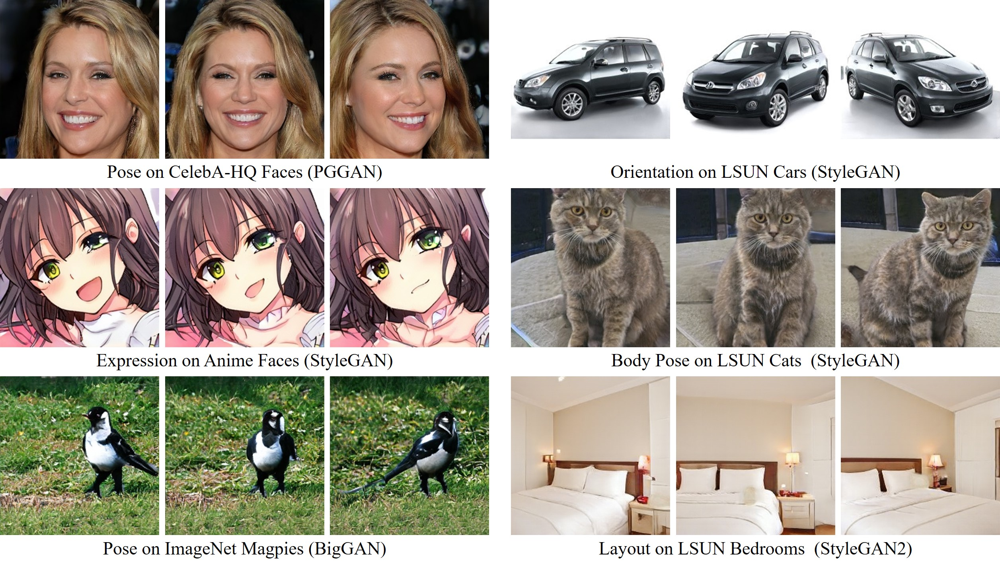
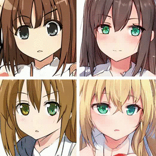
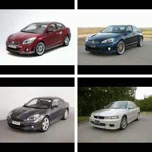

# SeFa - Closed-Form Factorization of Latent Semantics in GANs


**Figure:** *Versatile semantics found from various types of GAN models using SeFa.*

> **Closed-Form Factorization of Latent Semantics in GANs** <br>
> Yujun Shen, Bolei Zhou <br>
> *Computer Vision and Pattern Recognition (CVPR), 2021 (**Oral**)*

[[Paper](https://arxiv.org/pdf/2007.06600.pdf)]
[[Project Page](https://genforce.github.io/sefa/)]
[[Demo](https://www.youtube.com/watch?v=OFHW2WbXXIQ)]
[[Colab](https://colab.research.google.com/github/genforce/sefa/blob/master/docs/SeFa.ipynb)]

In this repository, we propose a *closed-form* approach, termed as **SeFa**, for *unsupervised* latent semantic factorization in GANs. With this algorithm, we are able to discover versatile semantics from different GAN models trained on various datasets. Most importantly, the proposed method does *not* rely on pre-trained semantic predictors and has an extremely *fast* implementation (*i.e.*, less than 1 second to interpret a model). Below show some interesting results on anime faces, cats, and cars.

**NOTE:** The following semantics are identified in a completely *unsupervised* manner, and post-annotated for reference.

| Anime Faces | | |
| :-- | :-- | :-- |
| Pose | Mouth | Painting Style
|  |  | 

| Cats | | |
| :-- | :-- | :-- |
| Posture (Left & Right) | Posture (Up & Down) | Zoom
|  |  | 

| Cars | | |
| :-- | :-- | :-- |
| Orientation | Vertical Position | Shape
|  |  | 

## Semantic Discovery

It is very simple to interpret a particular model with

```bash
MODEL_NAME=stylegan_animeface512
LAYER_IDX=0-1
NUM_SAMPLES=5
NUM_SEMANTICS=5
python sefa.py ${MODEL_NAME} \
    -L ${LAYER_IDX} \
    -N ${NUM_SAMPLES} \
    -K ${NUM_SEMANTICS}
```

After the program finishes, there will be two visualization pages in the directory `results`.

**NOTE:** The pre-trained models are borrowed from the [genforce](https://github.com/genforce/genforce) repository.

## Interface

We also provide an interface for interactive editing based on [StreamLit](https://www.streamlit.io/). This interface can be locally launched with

```bash
pip install streamlit
CUDA_VISIBLE_DEVICES=0 streamlit run interface.py
```

After the interface is launched, users can play with it via a browser.

**NOTE:** We have prepared some latent codes in the directory `latent_codes` to ensure the synthesis quality, which is completely determined by the pre-trained generator. Users can simply skip these prepared codes by clicking the `Random` button.

## BibTeX

```bibtex
@inproceedings{shen2021closedform,
  title     = {Closed-Form Factorization of Latent Semantics in GANs},
  author    = {Shen, Yujun and Zhou, Bolei},
  booktitle = {CVPR},
  year      = {2021}
}
```
